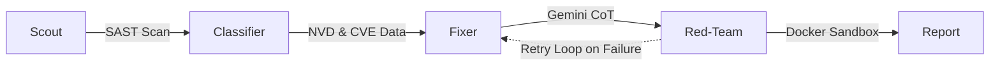

<div align="center">
  <h1>🛡️ GuardianLoop</h1>
  <p><strong>Autonomous Security Pipeline: Find, Classify, Patch, and Verify Vulnerabilities</strong></p>

  [](LICENSE)
  [](https://www.python.org/downloads/)
  [](https://www.docker.com/)
  
  *Automate your security workflow with AI-driven analysis and adversarial verification.*
</div>

---

## ⚡ Why GuardianLoop?

Unlike conventional SAST tools that dump hundreds of false-positive alerts, GuardianLoop **closes the loop**. It uses **Gemini 2.5 LLMs** with Chain-of-Thought (CoT) reasoning to generate semantic patches, and then immediately subjects those patches to a **live exploit inside a hardened Docker sandbox**. 

If the patch fails, the Red-Team feedback is looped back to the Fixer to refine the fix until it is provably secure!

---

## 🏗️ The 5-Agent Architecture

GuardianLoop operates as a multi-agent system, working in harmony to secure your code.



1. 🕵️ **Scout Agent**: Static analysis (Semgrep + Bandit) across source files.
2. 🧠 **Classifier Agent**: Maps findings to CVE records and CVSS severity scores via the NVD REST API.
3. 🛠️ **Fixer Agent**: Leverages **Gemini 2.5 Pro** to generate semantic patches and explanations.
4. 💥 **Red-Team Agent**: Executes an exploit against the patched code inside an isolated container. Feeds crash logs back to the Fixer on failure.
5. 📊 **Report Agent**: Compiles the run into structured CI/CD audit reports (`report.md`, `SARIF`, `JSON`).

---

## 🚀 Quickstart (1-Click Launch)

Get up and running locally in seconds.

### Prerequisites
- **Docker Desktop** installed and running.
- **Google Gemini API Key** (Free tier available at [Google AI Studio](https://aistudio.google.com/)).

### Installation
1. **Clone the repository:**
   ```bash
   git clone https://github.com/tan1sh-dev/GuardianLoop.git
   cd GuardianLoop
   ```

2. **Run the startup script:**
   - **Windows:** `.\start.bat`
   - **macOS / Linux:** `bash start.sh`

   *Note: Ensure Docker Desktop is open and running before executing the script.*
   *The script will verify Docker, prompt for your API key, build the sandboxes, and launch the web interface.*

3. **Access the Dashboard:**
   Open your browser and navigate to 👉 **`http://localhost:8080`**

---

## 🎯 Features

### 📥 4 Ingress Modes
- **File Upload**: Upload `.py`, `.c`, `.cpp`, `.h`, `.hpp` files directly (up to 1MB).
- **Code Snippets**: Paste code straight into the dashboard scanner.
- **GitHub PR Integration**: Point to any GitHub Pull Request URL to scan it instantly.
- **Interactive Demo**: 1-click test drive on vulnerable sample code.

### ⚙️ Dynamic Configuration
- **Model Selection**: Switch between `gemini-2.5-pro` (high reasoning) and `gemini-2.5-flash` (fast).
- **Retry Loops**: Configure how many times the Red-Team should challenge the Fixer (default: 3).
- **API Key Quota Rotation**: Pass multiple Gemini keys in your `.env` to bypass free-tier rate limits.
- **Semgrep Pro**: Optionally add `SEMGREP_APP_TOKEN` to unlock Enterprise rules.

### 🧩 Extendable Rulesets
Add your own rules without rebuilding containers!
- Place any Semgrep `.yaml` file into the `./rules/` directory.
- The **Scout** agent automatically picks it up on the next scan.
- See our [Contributing Guidelines](CONTRIBUTING.md) for more details.

---

## 🔒 Hardened Sandbox
The Red-Team executes code in a strict, non-negotiable environment:
- `--network=none`: Total network isolation.
- `--read-only`: Immutable root filesystem.
- `--memory=512m`: Strict memory cap.
- `--cpus=1`: CPU execution cap.

---

## 🤖 CI/CD Integration
Run GuardianLoop as an automated security gate in your GitHub Actions pipeline.
- Template provided in: [`examples/github-actions/guardianloop-scan.yml`](examples/github-actions/guardianloop-scan.yml)
- Enforce provably secure code before every merge!

---

## 📄 License
GuardianLoop is released under the [MIT License](LICENSE).
